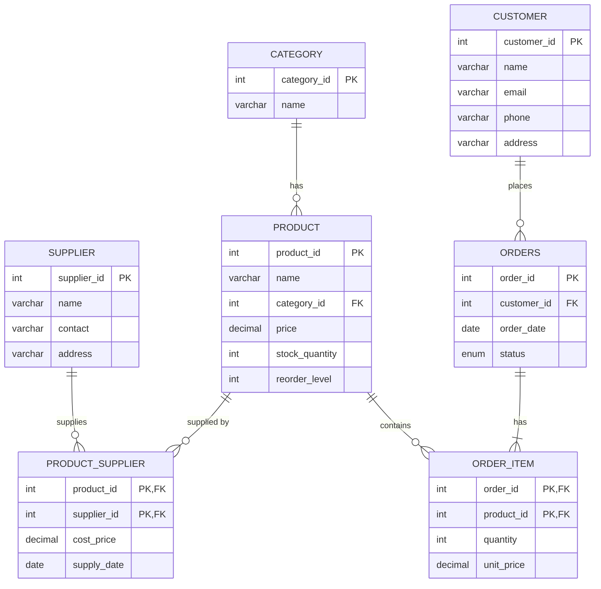

# E-Commerce Inventory System: ER Diagram & DBMS Concepts

**Course:** CSE3001 Database Management Systems
**Database:** `ecommerce_inventory` (MySQL 8)
**Files:** `schema.sql`, `ER_Diagram_Table.jpeg`

This document explains (1) how the ER diagram works, (2) how every table is connected and why, (3) why some relationships are called **"has"**, and (4) how each unit of the CSE3001 syllabus is applied in this project.

---

## Table of Contents
1. [Project overview](#1-project-overview)
2. [ER model basics](#2-er-model-basics-used-in-the-diagram)
3. [Entities and attributes](#3-entities-and-attributes)
4. [Relationships table by table](#4-relationships-table-by-table)
5. [Why is it called the "has" relationship?](#5-why-is-it-called-the-has-relationship)
6. [ER diagram to relational schema mapping](#6-er-diagram-to-relational-schema-mapping)
7. [Constraints and integrity rules](#7-constraints-and-integrity-rules)
8. [Normalization analysis](#8-normalization-analysis)
9. [Syllabus concepts mapped to the project](#9-syllabus-concepts-mapped-to-the-project)
10. [Sample queries (SQL and relational algebra)](#10-sample-queries)
11. [Advanced features: views, triggers, procedures, transactions](#11-advanced-features)
12. [Known limitations and possible improvements](#12-known-limitations-and-improvements)
13. [Viva questions with short answers](#13-likely-viva-questions)

---

## 1. Project overview

The system tracks an online store's **inventory**:

- Products are organised into **categories**.
- Products are bought from **suppliers** (at a cost price).
- **Customers** place **orders**, and each order contains one or more **products** in some quantity.
- Stock is tracked in `Product.stock_quantity`, with a `reorder_level` that signals when to restock.

**Purpose of a DBMS here (Unit 1):** a plain file system (say, a spreadsheet) would duplicate customer and product data, allow inconsistent updates, and make queries such as "which products are below reorder level?" slow and awkward. A DBMS gives us data independence, integrity constraints, concurrent multi-user access, and a declarative query language (SQL).

---

## 2. ER model basics used in the diagram

| Symbol in diagram | Meaning | Example |
|---|---|---|
| Rectangle (coloured box) | **Entity**, a real-world object that becomes a table | `PRODUCT` |
| Diamond | **Relationship**, a verb connecting entities | `has`, `supplied by` |
| `PK` | **Primary key**, uniquely identifies a row | `product_id` |
| `FK` | **Foreign key**, refers to a PK in another table | `category_id` |
| `1`, `N` | **Cardinality** (how many rows can be related) | 1 category : N products |

### Cardinality types
- **One-to-One (1:1):** one row in A relates to at most one row in B.
- **One-to-Many (1:N):** one row in A relates to many rows in B. *Most common.*
- **Many-to-Many (M:N):** many rows in A relate to many rows in B. It needs a **junction (associative) table**.

---

## 3. Entities and attributes

| Entity | Primary Key | Other attributes | Purpose |
|---|---|---|---|
| **Category** | `category_id` | `name` (unique) | Groups products (Electronics, Books, ...) |
| **Product** | `product_id` | `name`, `category_id` (FK), `price`, `stock_quantity`, `reorder_level` | The item sold and stocked |
| **Supplier** | `supplier_id` | `name`, `contact`, `address` | Vendor who supplies products |
| **Product_Supplier** | (`product_id`, `supplier_id`) | `cost_price`, `supply_date` | Junction table for Product and Supplier |
| **Customer** | `customer_id` | `name`, `email` (unique), `phone`, `address` | Buyer |
| **Orders** | `order_id` | `customer_id` (FK), `order_date`, `status` | One purchase transaction |
| **Order_Item** | (`order_id`, `product_id`) | `quantity`, `unit_price` | Junction table for Orders and Product |

> `Orders` is named with an "s" because `ORDER` is a reserved SQL keyword (`ORDER BY`).

---

## 4. Relationships table by table

### ER diagram in Mermaid (GitHub renders this automatically)



### 4.1 Category **has** Product (1 : N)
- One category has many products; each product belongs to exactly **one** category.
- Implemented by `Product.category_id` → `Category.category_id`.
- `ON DELETE RESTRICT`: you cannot delete a category that still has products, which prevents orphan products.
- `ON UPDATE CASCADE`: if a category id changes, products follow automatically.
- `Product.category_id` is `NOT NULL`, so this is **total participation**: every product *must* have a category.

### 4.2 Product **supplied by** Supplier (M : N, resolved by `Product_Supplier`)
- One product can be supplied by many suppliers, and one supplier can supply many products.
- A relational table cannot store a M:N link directly, so we create **Product_Supplier** with a **composite primary key** (`product_id`, `supplier_id`), where each part is also a FK.
- The relationship's own attributes (`cost_price`, `supply_date`) live in this table. They belong to the *pair*, not to product or supplier alone.
- `ON DELETE CASCADE` on both FKs: deleting a product or supplier removes its supply records.

### 4.3 Customer **places** Orders (1 : N)
- One customer can place many orders; each order belongs to exactly one customer.
- Implemented by `Orders.customer_id` → `Customer.customer_id`.
- `ON DELETE RESTRICT`: a customer with order history cannot be deleted, so sales records stay intact.

### 4.4 Orders **has** Order_Item (1 : N) and Product **contains** Order_Item (1 : N)
- Between `Orders` and `Product` there is really a **M:N relationship**: one order contains many products, and one product appears in many orders.
- It is resolved by the junction table **Order_Item** with PK (`order_id`, `product_id`). The diagram draws this as two 1:N relationships:
  - `Orders 1 —— has —— N Order_Item`
  - `Product 1 —— contains —— N Order_Item`
- `quantity` and `unit_price` belong to the pair (this product in this order).
- `Order_Item.order_id` uses `ON DELETE CASCADE` (deleting an order deletes its line items), while `Order_Item.product_id` uses `ON DELETE RESTRICT` (a product that has been sold cannot be deleted, which preserves sales history).

### Summary of all connections

| # | Parent (1 side) | Child (N side) | Relationship label | Via | Delete rule |
|---|---|---|---|---|---|
| 1 | Category | Product | has | `Product.category_id` | RESTRICT |
| 2 | Product | Product_Supplier | supplied by | `product_id` | CASCADE |
| 3 | Supplier | Product_Supplier | supplied by | `supplier_id` | CASCADE |
| 4 | Customer | Orders | places | `Orders.customer_id` | RESTRICT |
| 5 | Orders | Order_Item | has | `order_id` | CASCADE |
| 6 | Product | Order_Item | contains | `product_id` | RESTRICT |

---

## 5. Why is it called the "has" relationship?

**Short answer:** "has" is not a table. It is just the *verb label* written inside a relationship diamond. Its job is to make the diagram readable as a sentence.

- `CATEGORY —has→ PRODUCT` reads as "A category **has** products."
- `ORDERS —has→ ORDER_ITEM` reads as "An order **has** line items."

The **"has-a"** wording is the most natural verb for a **parent-child (1:N)** or **whole-part** relationship, where one entity owns or groups many of another. That is why it appears twice in the diagram.

### Why "has" has no table in `schema.sql`
Relationships are mapped to tables based on their **cardinality**:

| Cardinality | How it is stored | Example here |
|---|---|---|
| **1 : N** | A **foreign key** on the N side. **No new table.** | `has` (Category→Product), `places` (Customer→Orders) |
| **M : N** | A **separate junction table** | `supplied by` → `Product_Supplier`; `Orders`↔`Product` → `Order_Item` |

So "has" between Category and Product is simply the column `Product.category_id`. It does not need a table of its own. If your teacher asks *"where is the `has` table?"*, the answer is: **it is implemented as a foreign key, because a 1:N relationship never needs its own table.**

### Naming note for your report
The same label "has" is used for two different relationships, which can be confusing. Consider clearer names:

| Current | Better alternative |
|---|---|
| Category **has** Product | Category **classifies** Product / Product **belongs to** Category |
| Orders **has** Order_Item | Orders **includes** Order_Item / Order_Item **is part of** Orders |

---

## 6. ER diagram to relational schema mapping

Rules applied (Unit 1 and Unit 2):

1. **Strong entity → table.** Its attributes become columns and its key attribute becomes the PK. (`Category`, `Product`, `Supplier`, `Customer`, `Orders`)
2. **1:N relationship → FK on the N side.** (`Product.category_id`, `Orders.customer_id`)
3. **M:N relationship → new table.** It contains the FKs of both entities, which together form the PK, plus any relationship attributes. (`Product_Supplier`, `Order_Item`)
4. **Composite/multi-valued attributes** would be split or moved to their own table. Every attribute here is already atomic.

### Weak entity / associative entity
A **weak entity** has no key of its own and depends on an owner entity. `Order_Item` behaves this way: a line item cannot be identified without its order (`order_id` is part of its PK), and it is deleted when its order is deleted (`ON DELETE CASCADE`). Strictly, because it also references `Product`, it is best described as an **associative entity** (a M:N relationship promoted to a table) with an *identifying* dependency on `Orders`.

---

## 7. Constraints and integrity rules

| Type | Where used | Purpose |
|---|---|---|
| **Entity integrity** (PK is unique, not NULL) | every table | Every row is identifiable |
| **Referential integrity** (FK must match an existing PK) | all FKs | No orphan rows |
| **Domain constraint** (`CHECK`, `ENUM`, data types) | `price >= 0`, `stock_quantity >= 0`, `quantity > 0`, `status ENUM(...)` | Only valid values are stored |
| **Key constraint** (`UNIQUE`) | `Category.name`, `Customer.email` | No duplicates |
| **NOT NULL** | most columns | Mandatory attributes |
| **DEFAULT** | `stock_quantity=0`, `reorder_level=10`, `status='Pending'`, `order_date=CURRENT_DATE` | Sensible starting values |
| **Referential actions** | `CASCADE`, `RESTRICT` | Controls what happens on update/delete |

**Keys used (Unit 2):**
- **Super key:** any set that identifies a row (e.g. `{customer_id, name}`).
- **Candidate keys:** `customer_id` and `email` in Customer.
- **Primary key:** `customer_id` (chosen).
- **Alternate key:** `email` (declared `UNIQUE`).
- **Composite key:** (`order_id`, `product_id`).
- **Foreign key:** `Product.category_id`, etc.
- **Surrogate key:** the `AUTO_INCREMENT` ids.

> `CHECK` constraints are enforced from **MySQL 8.0.16**, and `DEFAULT (CURRENT_DATE)` needs **8.0.13+**. Older versions parse but silently ignore `CHECK`.

---

## 8. Normalization analysis

Normalization removes redundancy and update/insert/delete anomalies (Unit 2).

| Normal form | Rule | Does the schema satisfy it? |
|---|---|---|
| **1NF** | All attributes atomic, no repeating groups | Yes. There are no multi-valued columns (products in an order are in `Order_Item`, not a comma-separated list). |
| **2NF** | 1NF + no partial dependency on part of a composite key | Yes. In `Order_Item`, `quantity` and `unit_price` depend on the *whole* (`order_id`, `product_id`). In `Product_Supplier`, `cost_price` and `supply_date` depend on the whole pair. |
| **3NF** | 2NF + no transitive dependency | Yes. Category name lives in `Category`, not in `Product`, so `product_id → category_id → name` is broken into two tables. |
| **BCNF** | Every determinant is a candidate key | Yes. In `Customer`, the determinants `customer_id` and `email` are both candidate keys. |
| **4NF** | No non-trivial multi-valued dependencies | Yes. Independent multi-valued facts (which suppliers supply a product, which products are ordered) are kept in separate tables. |

### Why `Order_Item.unit_price` is *not* a redundancy
It looks like a copy of `Product.price`, but it is a deliberate **snapshot**: the price at the moment of sale. If `Product.price` changes later, old orders must still show what the customer actually paid. It is a functional dependency on (`order_id`, `product_id`), not on `product_id` alone, so 2NF still holds.

### Example of the anomalies avoided
If everything were one flat table `(order_id, customer_name, customer_email, product_name, category_name, price, ...)`:
- **Update anomaly:** changing a customer's email means editing many rows.
- **Insert anomaly:** you cannot add a new product until it is ordered.
- **Delete anomaly:** deleting the only order for a product deletes the product's information.

---

## 9. Syllabus concepts mapped to the project

### Unit 1: Introduction, Data Models, ER Model
| Syllabus topic | In this project |
|---|---|
| Purpose of database system | Avoids redundancy and inconsistency of a file system (see section 1) |
| View of data / levels of abstraction | **Physical:** storage of tables and indexes. **Logical:** the tables in `schema.sql`. **View level:** views such as `v_low_stock` (section 11) |
| Data independence | Adding an index (`idx_product_category`) does not change any query or application. This is *physical* data independence. |
| Database languages | **DDL** = `CREATE TABLE`, **DML** = `INSERT/UPDATE/SELECT`, **DCL** = `GRANT`, **TCL** = `COMMIT/ROLLBACK` |
| Database users & DBA | End users (customers), application programmers, DBA (manages schema, indexes, backup) |
| ER model, constraints, ERD issues | Entities, relationships, cardinality, participation (sections 2 to 4) |
| Weak entity sets | `Order_Item` (section 6) |

### Unit 2: Relational Model & Normalization
| Syllabus topic | In this project |
|---|---|
| Structure of relational DB, domains, relations | Each table is a relation, each column has a domain (`INT`, `DECIMAL(10,2)`, `ENUM`...) |
| Keys and integrity rules | Section 7 |
| Relational algebra (σ, π, ⋈, ∪, ρ, ÷) | Section 10 |
| Tuple relational calculus | Example in section 10 |
| Codd's rules | Rule 1 (information rule: everything is in tables), Rule 3 (systematic NULL treatment), Rule 10 (integrity independence: constraints are stored in the catalog, not the application) |
| Normalization 1NF to 4NF | Section 8 |
| UML | The ER diagram can be redrawn as a UML class diagram, with tables as classes and FKs as associations with multiplicities `1` and `*` |

### Unit 3: SQL
| Syllabus topic | In this project |
|---|---|
| DDL | `CREATE DATABASE/TABLE/INDEX`, `DROP DATABASE` |
| DML, TCL | `INSERT/UPDATE/DELETE`, `COMMIT/ROLLBACK/SAVEPOINT` |
| Aggregate functions, GROUP BY, ORDER BY | Revenue per category, orders per customer (section 10) |
| NULL values | `Customer.phone` and `address` are nullable. Use `IS NULL`, not `= NULL`. |
| Nested subqueries | Products never ordered (`NOT IN`/`NOT EXISTS`) |
| Joins, set operators | `INNER`, `LEFT JOIN`; `UNION`, `INTERSECT` |
| Views | `v_low_stock`, `v_order_totals` (data independence + security) |
| Indexes | `idx_product_category`, `idx_order_customer`, `idx_orderitem_product` |
| Sequences / synonyms | MySQL uses `AUTO_INCREMENT` instead of Oracle sequences. |
| Triggers | Auto-reduce stock, audit log (section 11) |

### Unit 4: PL/SQL, Storage, Query Optimization
| Syllabus topic | In this project |
|---|---|
| PL/SQL (procedures, functions, cursors, exceptions) | MySQL's equivalent is **stored procedures/functions** with `CURSOR` and `DECLARE ... HANDLER` (section 11). PL/SQL is Oracle-specific; the ideas are identical. |
| Indexing (ordered indices, **B+ tree**) | MySQL InnoDB builds a **B+ tree** for every primary key and index. FK columns are indexed to speed up joins. |
| Hashing | Static/dynamic hashing are alternatives to B+ trees; InnoDB also uses an adaptive hash index internally. |
| Query processing and cost | Use `EXPLAIN` to see the plan (section 10). |
| Query optimization | Heuristic (push selections before joins, project early) and cost-based (the optimizer picks join order and index using statistics). |

### Unit 5: Transactions, Concurrency, Recovery
| Syllabus topic | In this project |
|---|---|
| ACID properties | **Placing an order** must (a) insert into `Orders`, (b) insert into `Order_Item`, (c) reduce `stock_quantity`. Either all happen or none (Atomicity). |
| Isolation levels, serializability | Two customers buying the last unit at the same time must not both succeed, so use `SELECT ... FOR UPDATE` or `SERIALIZABLE`. |
| Lock-based protocols, deadlocks | InnoDB uses row-level locks. Two transactions updating products in opposite order can deadlock, and MySQL rolls one back. |
| Timestamp protocols, MVCC | InnoDB uses MVCC (snapshot reads) under `REPEATABLE READ`. |
| Recovery, durability | InnoDB redo log and undo log, with `mysqldump` for backups. |
| Two-phase commit | Used when a transaction spans several databases (e.g. inventory DB and payment DB). |

---

## 10. Sample queries

### SQL

```sql
-- 1. Products with their category (JOIN)
SELECT p.name AS product, c.name AS category, p.price
FROM Product p
JOIN Category c ON c.category_id = p.category_id;

-- 2. Products at or below reorder level (selection)
SELECT product_id, name, stock_quantity, reorder_level
FROM Product
WHERE stock_quantity <= reorder_level;

-- 3. Total value of each order (aggregate + GROUP BY)
SELECT o.order_id, c.name AS customer,
       SUM(oi.quantity * oi.unit_price) AS order_total
FROM Orders o
JOIN Customer c    ON c.customer_id = o.customer_id
JOIN Order_Item oi ON oi.order_id   = o.order_id
GROUP BY o.order_id, c.name
ORDER BY order_total DESC;

-- 4. Revenue per category
SELECT c.name AS category, SUM(oi.quantity * oi.unit_price) AS revenue
FROM Category c
JOIN Product p     ON p.category_id = c.category_id
JOIN Order_Item oi ON oi.product_id = p.product_id
GROUP BY c.name
HAVING revenue > 0;

-- 5. Products never ordered (nested subquery)
SELECT name FROM Product
WHERE product_id NOT IN (SELECT product_id FROM Order_Item);

-- 6. Customers with no orders (LEFT JOIN + NULL)
SELECT c.name
FROM Customer c
LEFT JOIN Orders o ON o.customer_id = c.customer_id
WHERE o.order_id IS NULL;

-- 7. Cheapest supplier for each product
SELECT p.name, s.name AS supplier, ps.cost_price
FROM Product_Supplier ps
JOIN Product p  ON p.product_id  = ps.product_id
JOIN Supplier s ON s.supplier_id = ps.supplier_id
WHERE ps.cost_price = (SELECT MIN(cost_price)
                       FROM Product_Supplier
                       WHERE product_id = ps.product_id);

-- 8. Profit margin per product (price minus cost)
SELECT p.name, p.price, ps.cost_price, (p.price - ps.cost_price) AS margin
FROM Product p JOIN Product_Supplier ps ON ps.product_id = p.product_id;

-- 9. Customers who bought from category 'Electronics' AND 'Books' (INTERSECT-style)
SELECT DISTINCT o.customer_id
FROM Orders o
JOIN Order_Item oi ON oi.order_id = o.order_id
JOIN Product p ON p.product_id = oi.product_id
JOIN Category c ON c.category_id = p.category_id
WHERE c.name = 'Electronics'
  AND o.customer_id IN (
      SELECT o2.customer_id
      FROM Orders o2
      JOIN Order_Item oi2 ON oi2.order_id = o2.order_id
      JOIN Product p2 ON p2.product_id = oi2.product_id
      JOIN Category c2 ON c2.category_id = p2.category_id
      WHERE c2.name = 'Books');

-- 10. See the optimizer's plan and index usage
EXPLAIN SELECT * FROM Product WHERE category_id = 3;
```

### Relational algebra equivalents

| Query | Relational algebra |
|---|---|
| Products priced above 500 | σ<sub>price > 500</sub>(Product) |
| Names and prices only | π<sub>name, price</sub>(Product) |
| Product with its category | Product ⋈<sub>Product.category_id = Category.category_id</sub> Category |
| Names of products in the 'Books' category | π<sub>Product.name</sub>(Product ⋈ σ<sub>Category.name='Books'</sub>(Category)) |
| Rename | ρ<sub>P(id, n)</sub>(π<sub>product_id, name</sub>(Product)) |
| Customers who ordered **every** product | π<sub>customer_id, product_id</sub>(Orders ⋈ Order_Item) ÷ π<sub>product_id</sub>(Product) |
| Number of items per order (grouping) | <sub>order_id</sub>𝓖<sub>SUM(quantity)</sub>(Order_Item) |

**Tuple relational calculus:** products in stock
`{ p | Product(p) ∧ p.stock_quantity > 0 }`

**Heuristic optimization idea:** for query 3 above, apply selections (e.g. `status='Delivered'`) *before* the joins, and project only the needed columns early to shrink intermediate results.

---

## 11. Advanced features

### 11.1 Views: data independence and security
```sql
CREATE VIEW v_low_stock AS
SELECT product_id, name, stock_quantity, reorder_level
FROM Product
WHERE stock_quantity <= reorder_level;

CREATE VIEW v_order_totals AS
SELECT o.order_id, o.customer_id, o.order_date, o.status,
       SUM(oi.quantity * oi.unit_price) AS total
FROM Orders o
JOIN Order_Item oi ON oi.order_id = o.order_id
GROUP BY o.order_id, o.customer_id, o.order_date, o.status;
```
A warehouse clerk can be given access to `v_low_stock` only, without seeing prices or customers. Views built with `GROUP BY` are read-only (not updatable).

### 11.2 Trigger: auto-reduce stock when an item is ordered
```sql
DELIMITER //
CREATE TRIGGER trg_reduce_stock
AFTER INSERT ON Order_Item
FOR EACH ROW
BEGIN
    UPDATE Product
    SET stock_quantity = stock_quantity - NEW.quantity
    WHERE product_id = NEW.product_id;
END//
DELIMITER ;
```
If the stock is insufficient, the `CHECK (stock_quantity >= 0)` constraint fails, so the whole insert fails. This is a nice demonstration of integrity constraints and triggers working together.

### 11.3 Trigger: audit trail (like Experiment 5 in the syllabus)
```sql
CREATE TABLE Product_Audit (
    audit_id   INT AUTO_INCREMENT PRIMARY KEY,
    product_id INT,
    old_price  DECIMAL(10,2),
    new_price  DECIMAL(10,2),
    changed_by VARCHAR(100),
    changed_at DATETIME DEFAULT CURRENT_TIMESTAMP
);

DELIMITER //
CREATE TRIGGER trg_price_audit
BEFORE UPDATE ON Product
FOR EACH ROW
BEGIN
    IF OLD.price <> NEW.price THEN
        INSERT INTO Product_Audit (product_id, old_price, new_price, changed_by)
        VALUES (OLD.product_id, OLD.price, NEW.price, USER());
    END IF;
END//
DELIMITER ;
```

### 11.4 Stored procedure with a transaction (ACID)
```sql
DELIMITER //
CREATE PROCEDURE place_order(
    IN p_customer_id INT,
    IN p_product_id  INT,
    IN p_qty         INT
)
BEGIN
    DECLARE v_price DECIMAL(10,2);
    DECLARE v_order_id INT;

    -- Any SQL error: undo everything, then re-raise the error
    DECLARE EXIT HANDLER FOR SQLEXCEPTION
    BEGIN
        ROLLBACK;
        RESIGNAL;
    END;

    START TRANSACTION;

    -- Lock the product row so two buyers cannot both take the last unit
    SELECT price INTO v_price
    FROM Product WHERE product_id = p_product_id FOR UPDATE;

    INSERT INTO Orders (customer_id) VALUES (p_customer_id);
    SET v_order_id = LAST_INSERT_ID();

    -- trg_reduce_stock fires here and lowers the stock
    INSERT INTO Order_Item (order_id, product_id, quantity, unit_price)
    VALUES (v_order_id, p_product_id, p_qty, v_price);

    COMMIT;
END//
DELIMITER ;

CALL place_order(1, 2, 3);
```

### 11.5 Function and cursor
```sql
DELIMITER //
CREATE FUNCTION get_order_total(p_order_id INT)
RETURNS DECIMAL(12,2)
DETERMINISTIC READS SQL DATA
BEGIN
    DECLARE v_total DECIMAL(12,2);
    SELECT IFNULL(SUM(quantity * unit_price), 0) INTO v_total
    FROM Order_Item WHERE order_id = p_order_id;
    RETURN v_total;
END//
DELIMITER ;

SELECT order_id, get_order_total(order_id) FROM Orders;
```
For cursors (explicit, row by row), use `DECLARE cur CURSOR FOR SELECT ...; OPEN cur; FETCH cur INTO ...; CLOSE cur;` together with `DECLARE CONTINUE HANDLER FOR NOT FOUND` to detect the end of the result.

### 11.6 Transaction control and isolation
```sql
START TRANSACTION;
UPDATE Orders SET status = 'Shipped' WHERE order_id = 1;
SAVEPOINT after_ship;
UPDATE Orders SET status = 'Delivered' WHERE order_id = 1;
ROLLBACK TO SAVEPOINT after_ship;   -- undo only the second update
COMMIT;

SET SESSION TRANSACTION ISOLATION LEVEL SERIALIZABLE;
```

| Isolation level | Dirty read | Non-repeatable read | Phantom |
|---|---|---|---|
| READ UNCOMMITTED | Possible | Possible | Possible |
| READ COMMITTED | No | Possible | Possible |
| REPEATABLE READ (MySQL default) | No | No | Mostly prevented in InnoDB |
| SERIALIZABLE | No | No | No |

---

## 12. Known limitations and improvements

Good points to mention to your teacher, since they show you understand the design trade-offs.

1. **`Product_Supplier` keeps only one supply record per (product, supplier) pair.** The PK is (`product_id`, `supplier_id`), so a repeat delivery overwrites the history. To store history, add `supply_date` to the PK or add a surrogate `supply_id`.
2. **Orders have no total column.** Totals are derived from `Order_Item` (a view or function). This avoids a derived-data redundancy that would violate the spirit of 3NF.
3. **Address is a single string.** Splitting it into `street, city, state, pincode` would improve queries by location and follow atomicity more strictly. (The furniture-company experiment in the syllabus stresses city/region/state analysis.)
4. **Multiple phones or addresses per customer** would need a separate `Customer_Phone` table (a multi-valued attribute).
5. **Payments and shipping** could be added as entities (`Payment`, `Shipment`).
6. **Diagram label:** the `places` relationship between Customer and Orders shows `1` and `N` close together at the Orders end. Make sure it reads **Customer (1) — places — Orders (N)**, matching the `Orders.customer_id` foreign key.
7. **Diagram naming:** two different relationships are both labelled "has" (see section 5).

---

## 13. Likely viva questions

**Q1. What is the difference between an entity and a relationship?**
An entity is a real-world object (Customer). A relationship is an association between entities (Customer *places* Orders).

**Q2. Why do we need `Product_Supplier` and `Order_Item`?**
Both resolve M:N relationships. A relational table cannot hold a multi-valued foreign key, so a junction table holds both keys plus the attributes of the relationship.

**Q3. Why is "has" not a table?**
It is a 1:N relationship, which is implemented as a foreign key on the "many" side. Only M:N relationships need their own table.

**Q4. What is the difference between `ON DELETE CASCADE` and `RESTRICT`?**
`CASCADE` deletes the dependent child rows automatically. `RESTRICT` blocks the delete if children exist.

**Q5. Why store `unit_price` again in `Order_Item`?**
To record the historical price at the time of sale, since `Product.price` can change.

**Q6. Which normal form is the schema in?**
BCNF (and hence 3NF, 2NF, 1NF). See section 8.

**Q7. Why index foreign-key columns?**
Joins and `WHERE` filters on FKs become B+ tree lookups instead of full table scans.

**Q8. Which property of ACID does `ROLLBACK` implement?**
Atomicity, meaning all-or-nothing. Durability is provided by `COMMIT` plus the redo log.

**Q9. What is the difference between a primary key and a unique key?**
A table has only one PK, which cannot be NULL. It can have many UNIQUE keys, which may allow NULL.

**Q10. What is total vs partial participation in this diagram?**
`Product.category_id` is `NOT NULL`, so every product must have a category (total). A category can exist with no products (partial).

---

## How to run

```bash
mysql -u root -p < schema.sql
```
Then paste the queries and objects from sections 10 and 11 into the MySQL shell or Workbench. Add some `INSERT` sample data first so the queries return results.

---
*Prepared for CSE3001 Database Management Systems project.*
